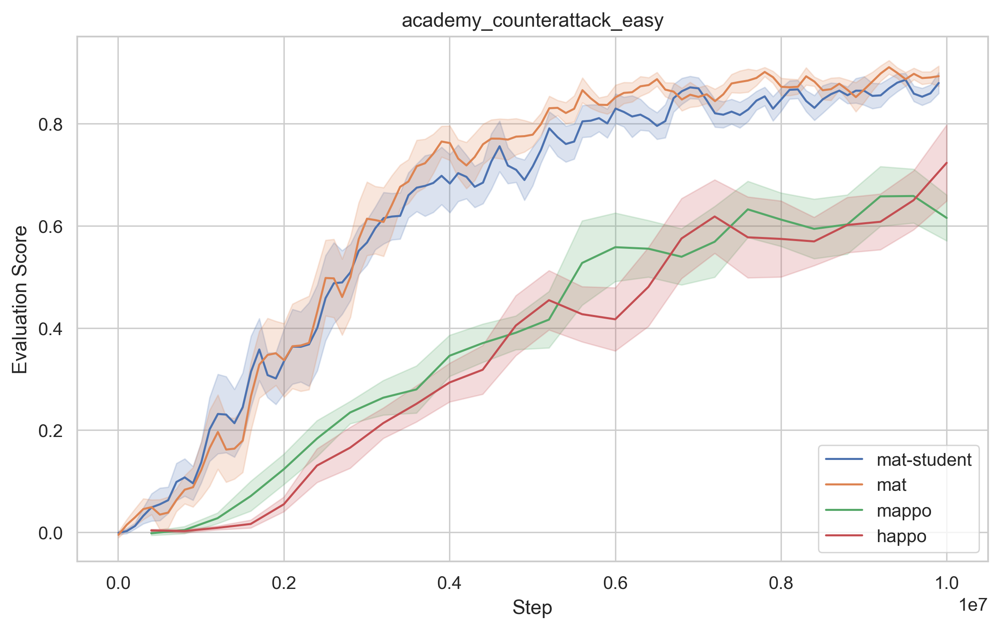
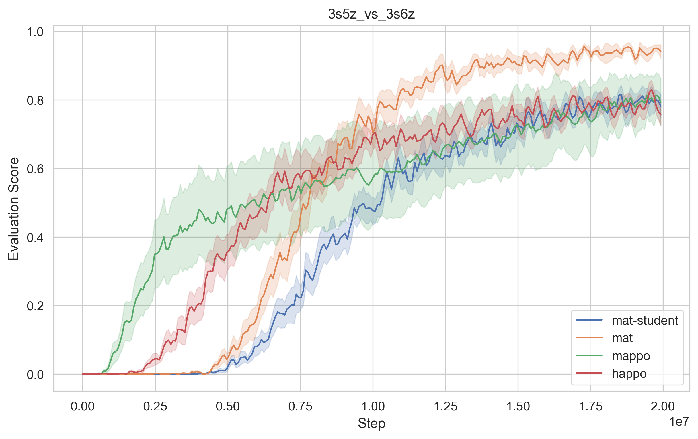
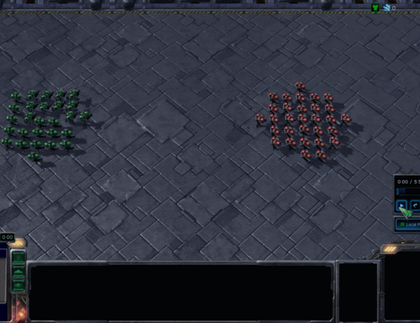
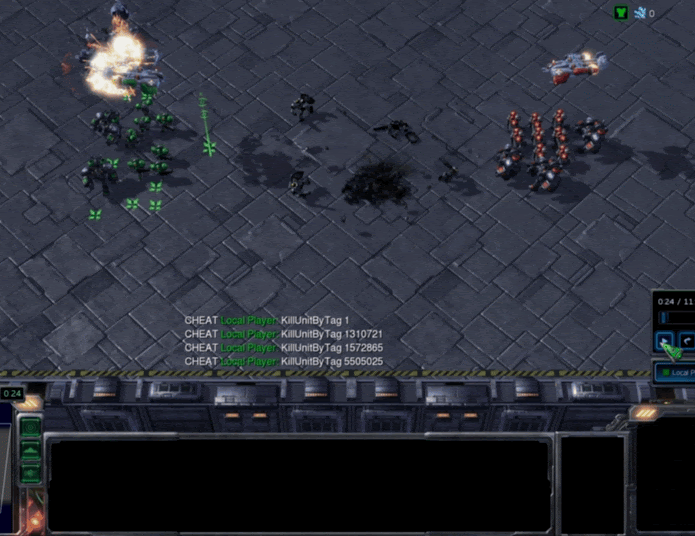
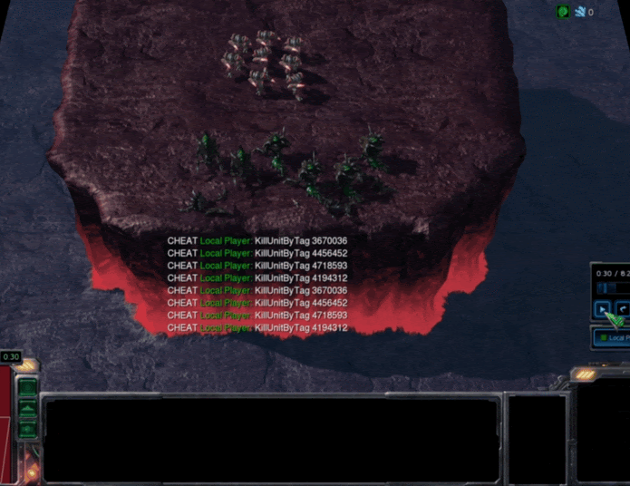
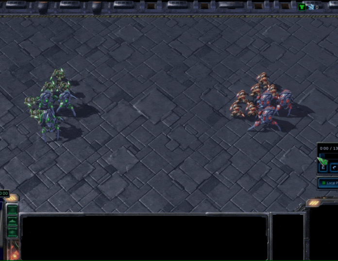
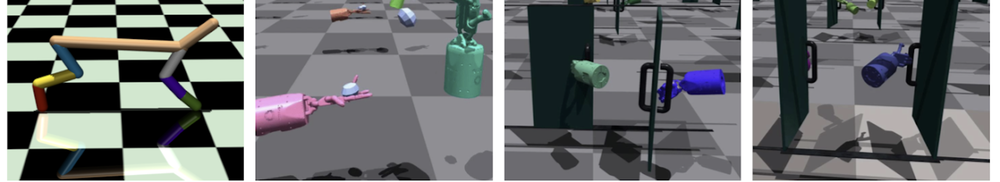
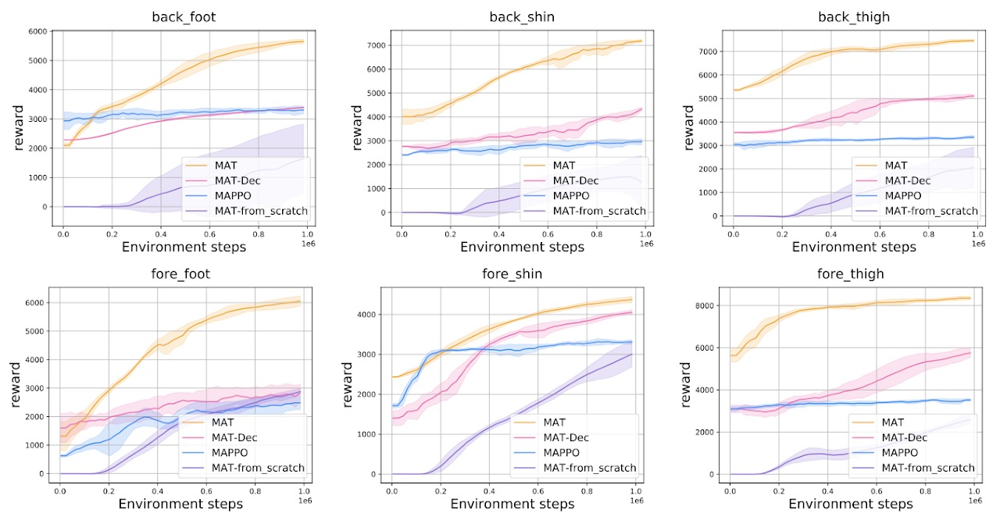
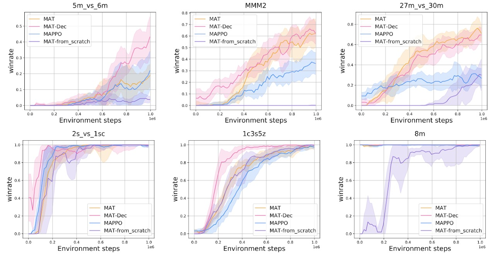

# Multi-Agent Transformer — Research Fork

> **Research fork.** This repository is based on the original
> [PKU-MARL/Multi-Agent-Transformer](https://github.com/PKU-MARL/Multi-Agent-Transformer)
> implementation. It is not the official implementation of MAT.

This repository extends MAT for reproducible multi-agent reinforcement
learning experiments across multiple simulators. In addition to the upstream
implementation, it provides:

- per-environment Docker images with locked dependencies;
- YAML-defined experiments, parameter sweeps, and local GPU selection;
- Slurm and Apptainer launch paths for cluster experiments; and
- git submodules for the third-party simulators used by selected environments.

The original MAT method is an encoder-decoder architecture for multi-agent
learning through sequence models. For the original project, paper, and method
details, see the upstream repository and project page:
https://sites.google.com/view/multi-agent-transformer.

In short, MAT:

* casts cooperative MARL into sequence modeling problems.

* is an encoder-decoder architecture building the bridge between MARL and the Transformer.

* is an online RL method trained by trails and errors, which is different from previous offline approaches, e.g. Decision Transformer or GATO (more like supervised learning). 

* leverages the multi-agent advantage decomposition theorem [Kuba et.al] to render only linear time complexity for multi-agent problems and ensure a monotonic performance improvement guarantee.

* achieves superior performance and generalisation capability on benchmarks including StarCraftII, Multi-Agent MuJoCo, Dexterous Hands Manipulation, and Google Research Football.

We present GIFs below to show the architecture and dynamic data flow of MAT.
||
|:-------------------------: |
|Architecture of MAT|    
 

## Running experiments

This fork supports SMAC, Football, MPE, VMAS, Robotarium,
JaxMARL-Robotarium, and multi-agent MuJoCo with environment-specific Docker
images. MARBLER and DexterousHandEnvs have additional external constraints;
refer to the Docker guide before using them.

Initialize the simulator submodules before building or running an environment
that needs them:

```bash
git submodule update --init --recursive
```

The recommended workflow is to build the image for the target environment and
define each experiment in YAML. For example, inspect a planned SMAC run from
the repository root with:

```bash
uv run python mat/scripts/run_yaml.py mat/scripts/configs/smac/smac_single.yaml --dry-run
```

Detailed instructions are maintained alongside the implementation:

- [Docker environments and known limitations](docker/README.md)
- [YAML experiment configuration, sweeps, and Slurm submission](mat/scripts/configs/README.md)

Training writes local results, checkpoints, W&B artifacts, and Slurm output to
ignored paths. Keep credentials outside the repository; local `.env` files and
their variants are ignored.

## Upstream attribution

The MAT algorithm and the original implementation are due to the upstream
authors. Please cite the original work when using MAT:

## Research abstract

Multi-agent reinforcement learning (MARL) is a promising approach for
cooperative tasks involving multiple decision-makers, including multi-robot
systems. Centralized execution can exploit the observations of all agents but
is often impractical under communication and scalability constraints.
Decentralized execution works under those constraints, but can lose
performance because each agent acts from local observations alone.

This research investigates policy distillation from a centralized MAT teacher
to decentralized student policies. The goal is to transfer the teacher's
coordinated strategy while retaining an execution-time policy that is usable
when communication is limited. The experiments evaluate this approach in
Google Research Football (GRF) and the StarCraft II Multi-Agent Challenge
(SMAC).

## Reported results

The following learning curves are reproduced from the accompanying thesis.
They compare MAT, its distilled student policy, MAPPO, and HAPPO; they are
research results rather than continuously updated CI benchmarks.

| Google Research Football: `academy_counterattack_easy` | SMAC: `3s5z_vs_3s6z` |
| --- | --- |
|  |  |


## Multi-Agent Sequential Decision Paradigm

Conventional multi-agent learning paradigm (left) wherein all agents take actions simultaneously vs. the multi-agent sequential decision paradigm (right) where agents take actions by following a sequential order, each agent accounts for decisions from preceding agents as red arrows suggest. 


The key insight of the multi-agent sequential decision paradigm is the multi-agent advantage decomposition theorem (a discovery in [HATRPO/HAPPO](https://arxiv.org/abs/2109.11251) [ICLR 22, Kuba et.al], indicating the advantage of joint actions could be sequentially divided as shown below.


## Performance Comparisons on Cooperative MARL Benchmarks

MAT consistently outperforms its rivals, indicating its modeling capability for homogeneous-agent tasks (agents are interchangeable).

Videos on four super-hard scenarios are shown below.

|||||
|:-----------: |:-------------------: |:-----------: |:----------: |
|27m vs 30m|MMM2|6h vs 8z|3s5z vs 3s6z|    


Demonstration and Performance comparison on Multi-Agent Mujoco HalfCheetah and  Bimanual Dexterous Hands Manipulation tasks, showing MAT's advantages in robot control for heterogeneous agents (agents are not interchangeable).




Performance comparison on the Google Research Football tasks with 2-4 agents from left to right respectively, telling the same conclusion that MAT outperforms MAPPO and HAPPO.


## MAT as Excellent Few-short Learners

Few-shot performance comparison with models pre-trained on complete HalfCheetah. MAT exhibits powerful generalisation capability when parts of the robot fail.



Few-shot performance comparison with pre-trained models on multiple SMAC tasks. Sequence-modeling-based methods, MAT and MAT-Dec, enjoy superior performance over MAPPO, justifying their strong generalisation capability as few-shot learners.




## Citation
Please cite as following if you think this work is helpful for you:
```
@article{wen2022multi,
  title={Multi-Agent Reinforcement Learning is a Sequence Modeling Problem},
  author={Wen, Muning and Kuba, Jakub Grudzien and Lin, Runji and Zhang, Weinan and Wen, Ying and Wang, Jun and Yang, Yaodong},
  journal={arXiv preprint arXiv:2205.14953},
  year={2022}
}
```
